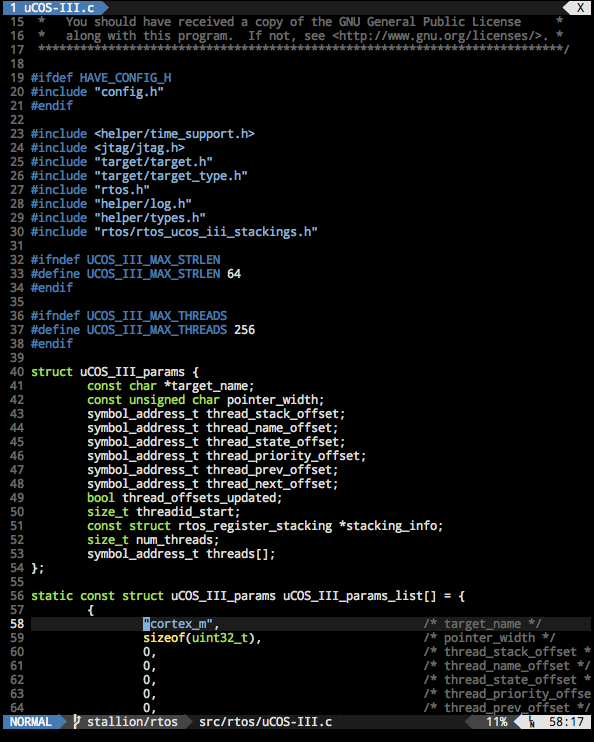

# Whiskey Tango Focus

Whiskey Tango Focus is a dark color scheme for Vim that strives for consistency
between terminal and GUI applications with graceful degradation for 256, 16, and
8 color terminals. Normal terminals are also supported, though with
significantly diminished returns.

Central to this color scheme is the role of contrast. The desired effect is to
bring important syntactical elements to the forefront, while allowing more
mundane elements, such as line numbers and the cursor line, to fade into the
background.

The color palette is based on the [Tango][1] theme provided by
[freedesktop.org][2], modified to match the [iTerm2][3] Dark Tango theme.

A compatible color scheme for [lightline.vim][4] can be found [here][5].

## Installation

This plugin is compatible with several popular plugin managers:

### Pathogen

    git clone git://github.com/sstallion/vim-wtf.git ~/.vim/bundle/vim-wtf

### Vundle

Add the following to your `.vimrc` and execute the `:PluginInstall` command:

    Plugin 'sstallion/vim-wtf'

### NeoBundle

Add the following to your `.vimrc` and execute the `:NeoBundleInstall` command:

    NeoBundle 'sstallion/vim-wtf'

### vim-plug

Add the following to your `.vimrc` and execute the `:PlugInstall` command:

    Plug 'sstallion/vim-wtf'

## Configuration

Like many other color schemes, `wtf` works with the underlying terminal color
palette. In order for colors to display correctly, the terminal must be
configured with a dark Tango theme with the appropriate number of colors.

To enable this color scheme, simply add the following to your `.vimrc`:

    colorscheme wtf

By default, the GUI will use the same colors as the terminal. If you wish to use
the classic Tango color palette instead, add the following to your `.vimrc`
before calling the `:colorscheme` command:

    let g:wtf_pedantic_guicolors = 1

## Contributing

Pull requests are welcome! If a problem is encountered using this plugin, please
file an issue on [GitHub][6].

## License

Source code in this repository is licensed under a Simplified BSD License. See
[LICENSE] for more details.

[1]: http://tango.freedesktop.org/Tango_Icon_Theme_Guidelines
[2]: https://www.freedesktop.org
[3]: https://www.iterm2.com/
[4]: https://github.com/itchyny/lightline.vim
[5]: https://github.com/sstallion/lightline-wtf
[6]: https://github.com/sstallion/vim-wtf/issues

[LICENSE]: LICENSE
